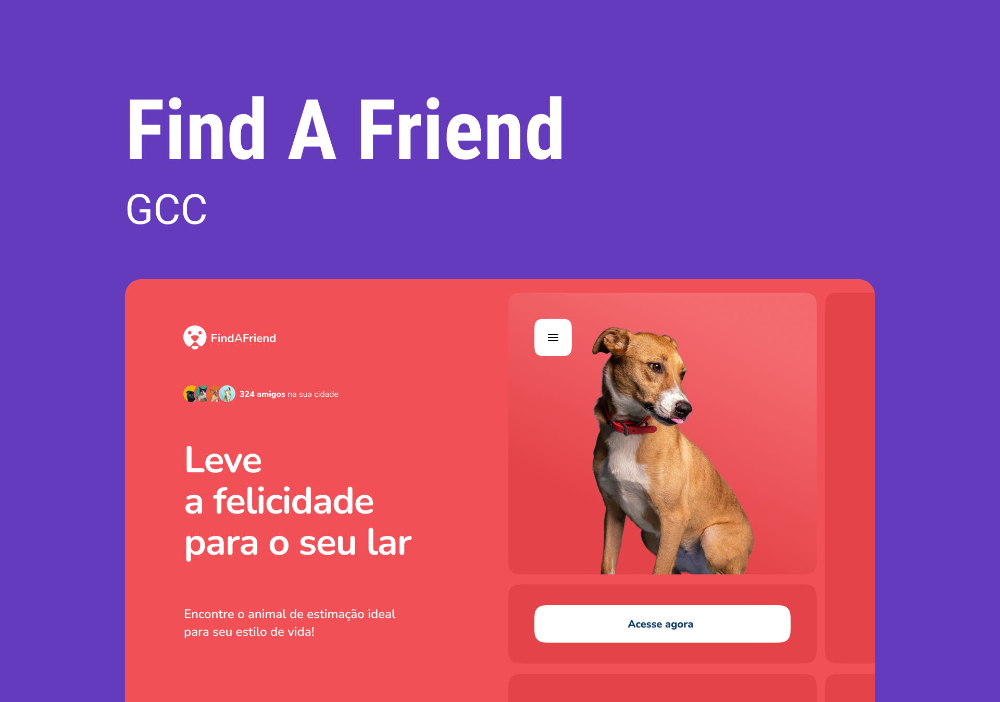

# FindAFriend

O Green Chain Challenge é um projeto da [Rocketseat](https://www.rocketseat.com.br/) desenvolvido especialmente para a comunidade com desafios que simulam situações reais que, você dev, vai encontrar no mercado de trabalho!

 

## 🐕 Sobre o projeto

O FindAFriend é um produto desenvolvido pela Startup FindAFriend onde você pode encontrar o animal de estimação ideal para seu estilo de vida!
No FindAFriend, as ONGs cadastram os bichinhos disponíveis para adoção informando características como: porte, nível de energia, nível de independência, sociabilidade e gênero.

Ao entrar na aplicação, a pessoa adotante pode filtrar os bichinhos de acordo com suas preferências e lifestyle.
Depois é só entrar em contato com a ONG para agendar uma visita e conhecer pessoalmente seu match perfeito!

 

## 🧪 Ferramentas

- [JavaScript](https://developer.mozilla.org/en-US/docs/Web/JavaScript)
- [React](https://reactjs.org/)
- [Styled-components](https://styled-components.com/)
- [Vite](https://vitejs.dev/)
- [React Icons](https://react-icons.github.io/react-icons/)

 

---

Developed with ❤️ by <a href="https://www.linkedin.com/in/paloma-rodrigues-539000233/" target="_blank">Paloma Rodrigues</a>

